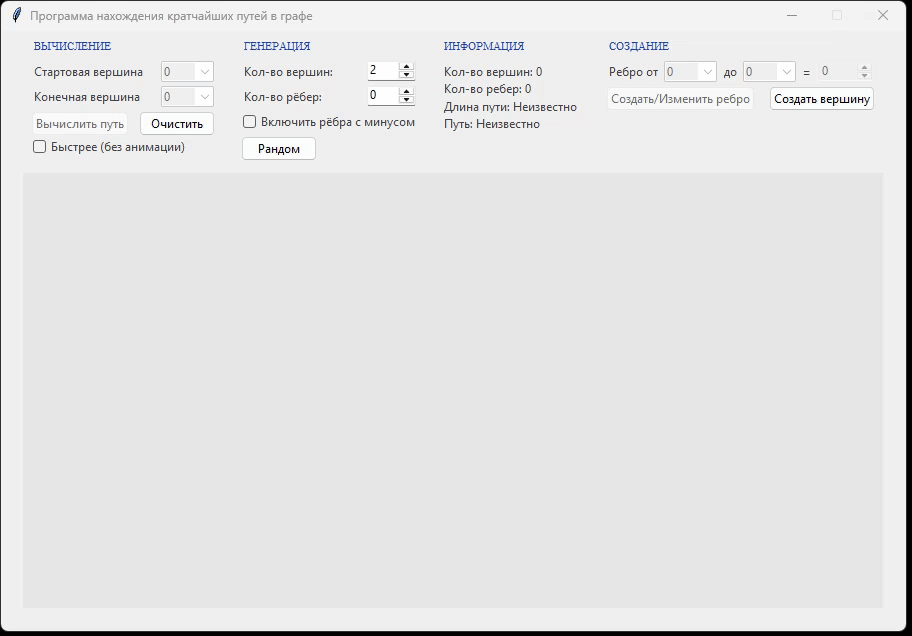

# Визуализатор кратчайших путей в графе (Bellman–Ford)


> **Pet-проект** по дисциплине «Языки программирования».  
> Реализация алгоритма Беллмана–Форда с графическим интерфейсом, анимацией и поддержкой отрицательных весов.




### О проекте

Приложение позволяет:

- вручную создавать вершины и рёбра (с указанием веса);
- генерировать случайные графы с заданным числом вершин и рёбер (включая отрицательные веса);
- находить **кратчайший путь** от одной вершины к другой;
- визуально наблюдать работу алгоритма (анимация релаксации, подсветка пути);
- корректно обрабатывать отрицательные циклы и отсутствие пути.

Проект написан на чистом Python без внешних зависимостей (кроме стандартной библиотеки).

### 🚀 Запуск

```bash
python main.py

